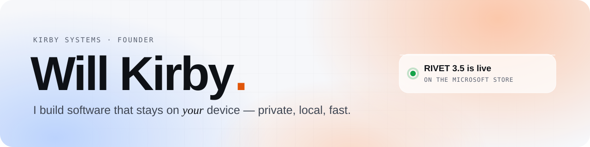
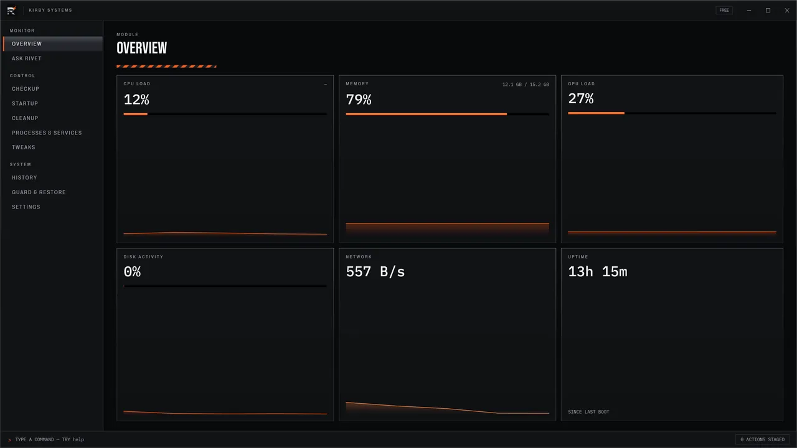
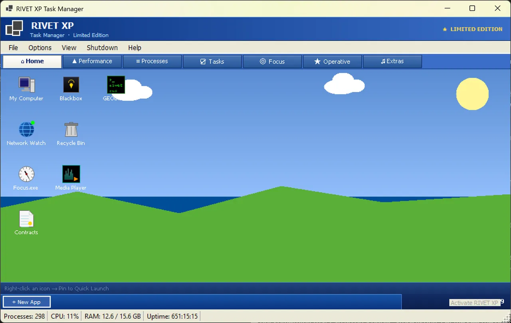

<picture>
  <source media="(prefers-color-scheme: dark)" srcset="assets/banner-dark.svg">
  
</picture>

  
  
  
  

I'm a student and indie developer, and the founder of **Kirby Systems**. I ship Windows software that runs locally, respects your privacy and doesn't need a subscription to the cloud. Alongside the code there are microcontrollers, CAD and 3D printing.

## What I've shipped

<table>
  <tr>
    <td width="58%" valign="top">
      
      <h3>RIVET</h3>
      
A native Windows system manager (.NET 10 + WPF). Live hardware stats, signed-process verification, startup impact ratings, plain-English tweaks, and <b>Ask RIVET</b>, a local AI that answers questions about your PC without sending anything off it. 3.5 adds Guard &amp; Restore, a first-run checkup and roll back to a date.

      
 

      
<a href="https://apps.microsoft.com/detail/9nvh0c7jzk0m?cid=github">Microsoft Store</a> · <a href="https://get-rivet.com">get-rivet.com</a>

    </td>
    <td width="42%" valign="top">
      
      <h3>RIVET XP</h3>
      
A Windows XP-styled task manager with a rank ladder, released as a 25th-anniversary tribute. Its own product.

      

      
<a href="https://apps.microsoft.com/detail/9nhxtc8075s4?cid=github">Microsoft Store</a>

    </td>
  </tr>
</table>

## How RIVET grew

| | | |
|---|---|---|
| **1.0** | Jarvis | A personal productivity tool. Never shipped, but it started everything. |
| **2.x** | [PowerShell](https://github.com/WilliamKirbyyyyyy/rivet) | Free, Lite and Pro on itch.io. 136 downloads. The source is in [`rivet`](https://github.com/WilliamKirbyyyyyy/rivet). |
| **3.0–3.3** | Native app | .NET 10 + WPF with on-device AI. On the Microsoft Store since July 2026. |
| **3.5** | Guard & rollback | Eleven new features, including a first-run checkup and roll back to a date. **Now live.** |

## Stack

  
  
  
  
  
  
  
  
  
  
  

## Recognition

| | |
|---|---|
| Perse Coding Team Challenge | 🏆 Distinction · best in school |
| BPhO Physics Challenge | 🥇 Gold |
| UK Bebras, Juniors | 🥇 Gold |
| UKMT Junior Maths Challenge | 🥈 Silver |
| Duke of Edinburgh's Award | Bronze · Silver in progress |

## Investigation

In February 2026 I recorded twelve listings on the Temu UK app for age-restricted or banned products, each available with no age check shown. Examples: disposable vapes, vape hardware filed under "Power Tools" and sparklers under "Makeup". I wrote it up with the law each listing engages and submitted it to Trading Standards. [More on my site →](https://willkirby.co.uk/#investigation)

## Currently

Preparing for UKOAI 2027 · learning neural networks · a high-altitude balloon payload · reprinting a DIY VR headset · shipping RIVET 3.5

RIVET 3's source is private, since it's a paid Store app. The original 2.x source is public in <a href="https://github.com/WilliamKirbyyyyyy/rivet"><code>rivet</code></a>.
